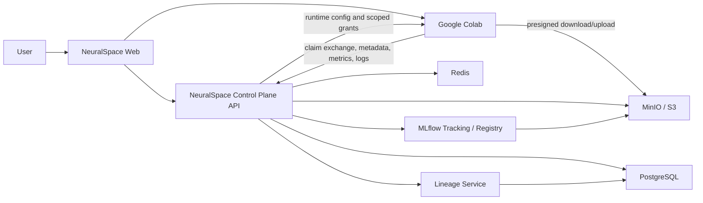
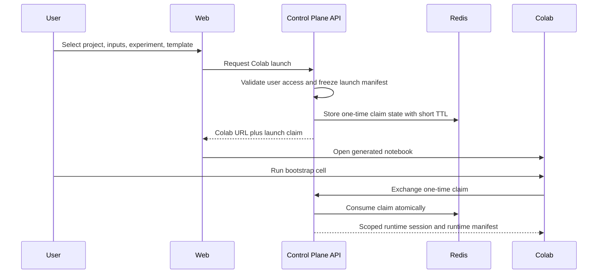
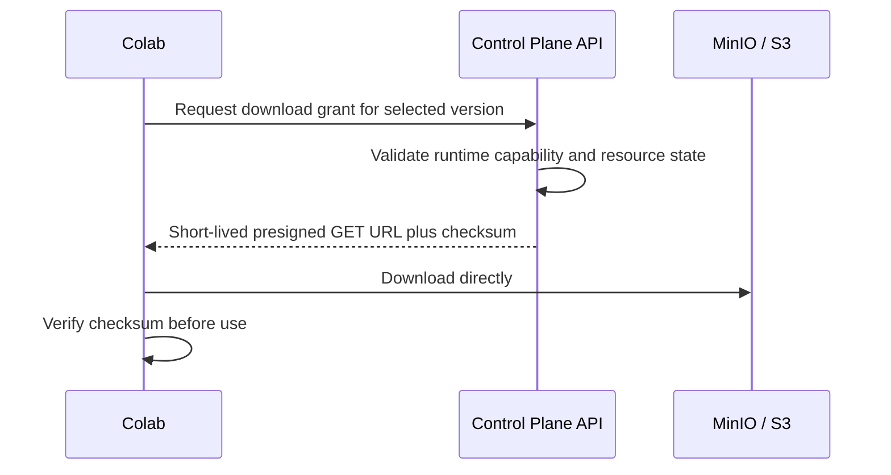
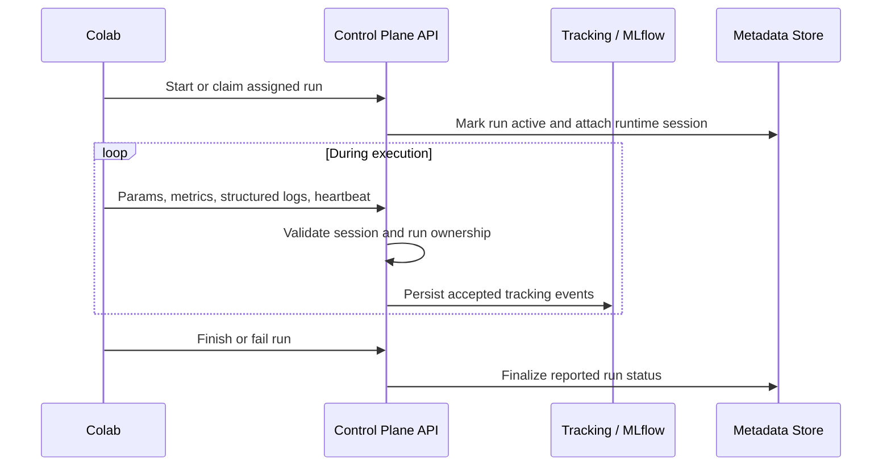
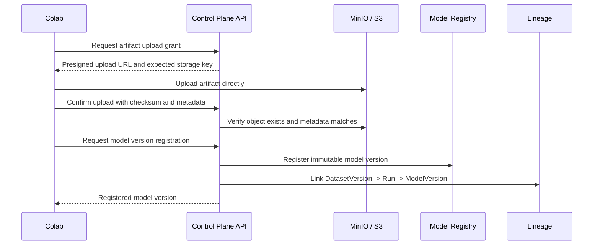

# NeuralSpace Control Plane with Google Colab External Runtime

## 1. Architectural Decision

NeuralSpace will operate as an MLOps and data control plane. Google Colab will
operate as an external, user-controlled compute runtime.

The control plane owns durable state, identity, authorization, metadata,
registries, lineage, artifact locations, and the lifecycle of logical training
runs. It does not own the Colab VM, GPU, process tree, notebook kernel, or cell
outputs.

This replaces the original assumption that a NeuralSpace workspace maps to a
Kubernetes namespace, pod, PVC, and Jupyter kernel.

### Core principle

Anything that must remain available after a Colab runtime disconnects must be
explicitly sent to or registered with the control plane.

Colab local disk, process state, variables, console output, and unreported
metrics are ephemeral and outside NeuralSpace's control.

## 2. System Scope

### NeuralSpace owns

- User-facing website and project/workspace configuration.
- Dataset registry and immutable dataset versions.
- Model registry and immutable model versions.
- Experiment definitions and logical run records.
- Params, metrics, structured logs, run status, and run summaries received from
  runtimes.
- Artifact metadata and storage coordination through MinIO/S3.
- Data lineage between dataset versions, runs, artifacts, and model versions.
- Colab notebook/template generation.
- Short-lived launch claims and scoped runtime sessions.
- Authorization decisions for every control-plane operation.
- Audit records for actions accepted by the backend.

### Google Colab owns

- Runtime allocation and availability.
- GPU/CPU/RAM selection and enforcement.
- Notebook kernel and Python process lifecycle.
- Cell execution, local variables, and cell output.
- Ephemeral local disk.
- User interaction with the notebook.
- Runtime disconnects, idle timeouts, and platform limits.

### Explicit non-goals

- Scheduling or guaranteeing a GPU.
- Remotely starting, stopping, restarting, or killing a Colab VM.
- Reading all notebook cells or outputs automatically.
- Guaranteeing that a run finishes after the user closes Colab.
- Treating a Colab runtime as trusted infrastructure.
- Synchronizing arbitrary Colab files unless the notebook uploads them.

## 3. Target Context



The browser launches Colab, but Colab communicates directly with the
control-plane API and object storage over public HTTPS. No inbound connection
from NeuralSpace to the Colab runtime is assumed.

## 4. Main Components

### 4.1 Web application

The web application is the orchestration UI. A user selects:

- Project or logical workspace.
- Dataset versions.
- Base model or model version.
- Experiment.
- Run configuration or notebook template.

The web application requests a Colab launch and opens the generated notebook.
It displays only control-plane state reported by the notebook, such as run
status, latest heartbeat, metrics, logs, artifacts, and registered outputs.

### 4.2 Control-plane API

The API is the policy and orchestration boundary. It:

- Authenticates web users.
- Validates access to selected resources before creating a launch.
- Creates a logical run or launch session.
- Issues a one-time, short-lived claim code.
- Exchanges the claim for a scoped runtime session.
- Returns runtime configuration and temporary data/artifact grants.
- Accepts metrics, params, logs, heartbeats, artifacts, and model registration.
- Updates lineage only after validating referenced entities.
- Records accepted actions and session activity.

The API must never expose MinIO credentials, database credentials, MLflow
backend credentials, or a normal user access token to Colab.

### 4.3 Colab launch and session service

This service connects browser intent to an external runtime.

It manages two separate credentials:

1. **Launch claim**
   - Single use.
   - Very short lived.
   - Used only to bootstrap a notebook.
   - Bound to a user, launch, project, selected resources, and intended
     operation.

2. **Runtime session token**
   - Issued only after a successful claim exchange.
   - Short lived and renewable while the session remains valid.
   - Scoped to one runtime session and normally one run.
   - Contains capabilities, not broad user permissions.

The current `colab/workspaces/{workspace_id}/launch` and `colab/bootstrap`
implementation is a useful starting point. The target model should evolve from
workspace ownership plus dataset IDs into an explicit external runtime session
with version-specific grants and run identity.

### 4.4 Notebook template and lightweight client

Generated notebooks should use a small NeuralSpace client library instead of
embedding repeated raw HTTP calls in every template.

The client is responsible for:

- Exchanging the launch claim.
- Holding and refreshing the runtime session token in memory.
- Downloading selected inputs through granted URLs.
- Creating or attaching to the assigned run.
- Logging params, metrics, logs, and heartbeats.
- Requesting presigned artifact upload URLs.
- Confirming completed uploads.
- Registering a model version and its lineage.
- Marking the run finished or failed when explicitly requested by notebook
  code.

The client is cooperative instrumentation. It is not an agent that gives
NeuralSpace control over Colab.

### 4.5 Registry and lineage services

Registries remain authoritative:

- A dataset version identifies an immutable data snapshot.
- A run identifies one logical execution attempt.
- A model version identifies a registered immutable model artifact.
- Lineage links inputs and outputs accepted by the backend.

The minimum lineage chain is:

```text
DatasetVersion -> Run -> ModelVersion
```

Additional artifacts may also be linked to a run. Lineage represents declared
and validated control-plane facts, not everything that happened inside Colab.

### 4.6 MinIO/S3

Object storage is the data plane for large payloads. The control plane should
authorize access and issue short-lived presigned URLs; Colab should transfer
large files directly to or from storage.

The backend should not proxy large datasets or model files unless a specific
security policy requires it.

All URLs used by Colab must resolve from the public internet over HTTPS.
Addresses such as `localhost`, Docker service names, or private cluster-only
MinIO endpoints are not usable from Colab.

### 4.7 MLflow

MLflow can remain the experiment tracking and model registry engine, but Colab
should not receive unrestricted direct access to the MLflow tracking server.

Preferred control-plane posture:

- NeuralSpace API validates and forwards accepted tracking events to MLflow, or
  exposes a tightly scoped tracking facade.
- MLflow remains an internal implementation detail.
- NeuralSpace keeps stable domain IDs and maps them to MLflow experiment, run,
  and model version IDs.

This prevents an external runtime from writing to unrelated experiments or
registering arbitrary models.

## 5. Multi-user Isolation Model

Every launch and runtime operation is evaluated against four identities:

| Identity | Purpose |
| --- | --- |
| User | Human who initiated the launch |
| Project | Authorization and organizational boundary |
| Runtime session | One Colab bootstrap and its temporary capabilities |
| Run | One logical training or inference attempt |

Two users opening the same notebook template receive different launch claims,
runtime sessions, resource grants, runs, and artifact prefixes.

### Required isolation rules

- A runtime session belongs to exactly one user and project.
- A runtime session can access only explicitly granted dataset versions, model
  versions, and artifact locations.
- A run belongs to the runtime session that created or claimed it.
- Artifact upload locations are scoped to the run or output entity.
- Presigned URLs are short lived and operation specific.
- The backend re-checks authorization when issuing every new grant.
- Client-provided user IDs, project IDs, owners, storage keys, and lineage IDs
  are never trusted without server-side validation.
- A runtime token cannot list or access resources outside its capabilities.

The object storage key layout should reinforce isolation even though it is not
the primary authorization mechanism:

```text
projects/{project_id}/datasets/{dataset_version_id}/...
projects/{project_id}/runs/{run_id}/artifacts/...
projects/{project_id}/models/{model_name}/{model_version}/...
```

## 6. End-to-end Data Flows

### 6.1 Launch and bootstrap



The launch manifest is a server-controlled snapshot of intended inputs and
permissions. It prevents the notebook from changing resource IDs during
bootstrap.

The launch claim may be transported in a URL for early development, but that
leaks into browser history and screenshots. A claim code pasted into the
notebook or a browser-mediated exchange is safer for production.

### 6.2 Dataset and model download



Runtime configuration should reference immutable dataset and model versions,
not mutable registry aliases such as "latest".

### 6.3 Run tracking



Metrics and logs should be sent in batches with event IDs or sequence numbers
so retries do not create duplicates.

If heartbeats stop, the control plane can mark a run `DISCONNECTED` or
`STALE`. It must not immediately claim that the run failed, because the Colab
runtime may still be executing while temporarily unable to reach the backend.

### 6.4 Artifact upload and model registration



Uploading an object does not by itself make it a trusted artifact. The backend
accepts it only after confirmation and validation.

## 7. Runtime and Run State

The control plane must separate external runtime connectivity from run outcome.

### Runtime session states

- `ISSUED`: launch claim created but not exchanged.
- `CONNECTED`: claim exchanged and runtime session active.
- `DISCONNECTED`: heartbeat missing beyond a threshold.
- `EXPIRED`: runtime session credentials expired.
- `REVOKED`: control plane refuses further operations.

### Run states

- `CREATED`: logical run allocated.
- `RUNNING`: notebook explicitly started reporting execution.
- `FINISHED`: notebook reported success and required outputs were accepted.
- `FAILED`: notebook explicitly reported failure.
- `CANCEL_REQUESTED`: user asked the notebook to stop cooperatively.
- `STALE`: no heartbeat or terminal event was received.

`CANCEL_REQUESTED` is advisory. NeuralSpace cannot guarantee that Colab stops.
Revoking a runtime token prevents future API and storage grants, but does not
kill local computation or invalidate already downloaded data.

## 8. Trust and Security Model

Google Colab is an untrusted external client, similar to a developer laptop.
The user can inspect and modify every notebook cell and every HTTP request.

### Security consequences

- Never embed long-lived secrets in generated notebooks.
- Never grant bucket-wide or project-wide storage credentials.
- Never trust metrics, logs, claimed checksums, model metadata, or lineage
  solely because they came from an official template.
- Validate every referenced entity and enforce session scope server side.
- Use public HTTPS for API and object storage endpoints.
- Rate-limit runtime endpoints independently from browser endpoints.
- Revoke runtime sessions when suspicious behavior is detected.
- Keep signed URL TTLs short and issue new grants only while the runtime
  session is authorized.
- Redact launch claims and runtime tokens from application logs.

### Data exfiltration boundary

After Colab downloads a dataset, NeuralSpace cannot prevent the user or
notebook code from copying it elsewhere. Therefore, Colab integration is only
appropriate for data that policy permits users to process in an external
runtime.

Highly sensitive datasets may require a managed compute option later. This is a
product and governance boundary, not a problem presigned URLs can solve.

## 9. Observability and User Experience

The website can show:

- Launch created, claimed, expired, or revoked.
- Runtime last-seen timestamp.
- Run status reported to the control plane.
- Latest metrics and logs received.
- Artifacts uploaded and verified.
- Model versions registered.
- Lineage recorded.

The website cannot reliably show:

- Current Colab GPU/RAM utilization.
- Exact cell currently executing.
- Complete stdout/stderr or cell output.
- Whether the browser tab or VM is still alive between heartbeats.
- Whether local computation stopped after token revocation.

The UI should use language such as "last reported", "connection stale", and
"cancel requested" rather than implying direct runtime control.

## 10. Existing System: Keep, Adapt, Retire

### Keep

- Dataset and model registries.
- Dataset and model versioning.
- Experiment and run tracking.
- MinIO/S3 artifact storage.
- MLflow integration.
- Lineage service.
- PostgreSQL, Redis, authentication, logging, and rate limiting.
- Notebook storage and templates where they remain useful.
- Existing Colab launch/bootstrap work as an initial prototype.

### Adapt

- Reframe a workspace as a logical project/context, not a running compute pod.
- Replace workspace lifecycle state with external runtime session and run
  connectivity state.
- Replace pod/PVC data mounting with version grants and presigned URLs.
- Replace kernel events with cooperative notebook telemetry.
- Replace "stop/restart workspace" with session revoke, cooperative cancel, and
  relaunch.
- Replace notebook-to-pod restore with notebook generation, storage, and Colab
  launch.
- Replace runtime resource monitoring with tracking of reported session
  activity and control-plane operations.

### Retire from the primary path

- Kubernetes namespace, pod, service, PVC, and Jupyter provisioning.
- Celery tasks that spawn or stop workspace compute.
- Idle-kill logic intended to delete internal runtimes.
- Kernel restart and direct Jupyter API operations.
- Workspace proxy and pod IP access.
- Claims that NeuralSpace controls runtime CPU/GPU/RAM.

These modules can remain temporarily behind a disabled legacy-runtime feature
flag during migration, but they should not shape new domain behavior.

## 11. Migration Strategy

### Phase 1: Establish Colab as a supported external runtime

- Keep current registries, storage, MLflow, and lineage.
- Introduce explicit external runtime session semantics.
- Generate a standard Colab notebook from selected versioned inputs.
- Exchange one-time claims for scoped sessions.
- Support direct dataset download and artifact upload through presigned URLs.
- Support run start, metrics, logs, heartbeat, finish/fail, and model
  registration.
- Label runtime state accurately in the UI.

### Phase 2: Make Colab the default runtime

- Change workspace/project UI actions from "Start workspace" to "Open in
  Colab".
- Remove Kubernetes-specific controls and resource tiers from the main UI.
- Stop provisioning new Kubernetes workspaces.
- Retain legacy runtime read access only where needed for migration.

### Phase 3: Remove internal runtime infrastructure

- Remove Kubernetes/Jupyter provisioning workers and services.
- Remove internal runtime monitoring, idle GC, proxy, and pod storage sync.
- Simplify deployment and operational dashboards.
- Archive or migrate remaining workspace notebooks and metadata.

### Phase 4: Optional controlled compute

If product needs later require guaranteed GPUs, sensitive-data isolation, or
remote job control, add a managed runtime provider as a separate adapter. Do
not weaken the external-runtime model to pretend Colab has these guarantees.

## 12. Accepted Limitations

Moving from Kubernetes/Jupyter to Colab deliberately trades control for lower
compute operational burden.

NeuralSpace accepts that:

- GPU availability, type, quota, and runtime duration are controlled by
  Google.
- Colab can disconnect or reset without notification.
- A user must open the notebook and run cells.
- Cancellation is cooperative, not authoritative.
- Runtime resource usage cannot be monitored reliably.
- Complete notebook state and output are unavailable unless explicitly sent.
- Local files disappear unless uploaded.
- Reported metrics and lineage describe what the notebook declared and the
  backend accepted; they are not an independent proof of execution.
- External processing is unsuitable for datasets that must not leave managed
  infrastructure.

These constraints must remain visible in product language, run status design,
security policy, and operational expectations.

## 13. Architectural Invariants

The following rules should remain true throughout implementation:

1. Registries and version metadata are authoritative in the control plane.
2. Large payloads move directly between Colab and object storage.
3. Colab receives capabilities scoped to one runtime session, never broad
   infrastructure credentials.
4. Every run and artifact is attributable to a user, project, and runtime
   session.
5. Runtime connectivity and run outcome are separate concepts.
6. Lineage is created only from backend-validated entity relationships.
7. Revocation stops future control-plane access but does not claim to stop
   Colab computation.
8. No feature implies control over Colab that NeuralSpace does not actually
   possess.
